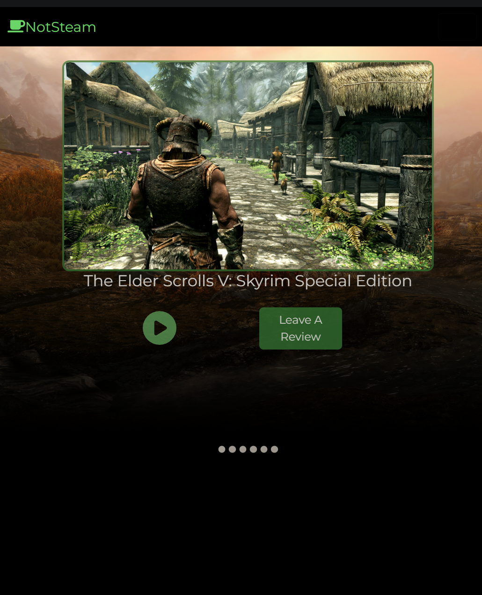
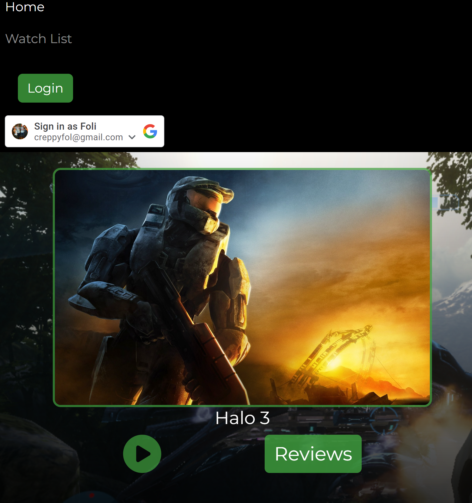
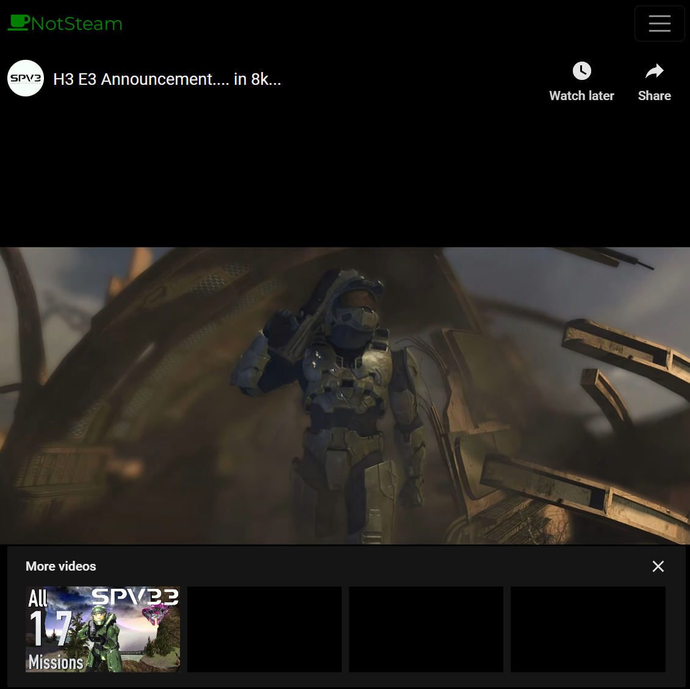

# NotSteam - Frontend

## Frontend React web application for NotSteam.games- a video game review web app that allows users to review popular video games.

NotSteam.games is a video game review web app built to allow users to share their opinions on popular video games. 
This React web application is built with JavaScript, React + Material UI, and Bootstrap, leverages Caddy HTTPS server, and uses Axios HTTP to communicate with the backend api.

## Authentication

Visitors to the site can log in using Google OAuth one-click login.

## Cloud Services

The application is deployed to Vercel, and is redeployed with every merge to main.

## Check it out!

https://notsteam.games/
